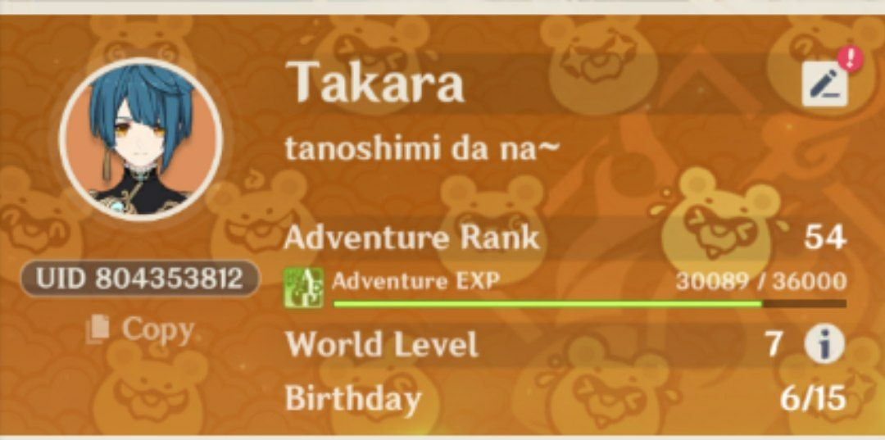

# Genshin Impact API Tutorial

This repository holds the codebase for building a simple website with the fan-made Genshin Impact API by Genshin.dev [here](https://github.com/genshindev/api).

If you're following along the tutorial, make sure that you're at the `/start` branch. But if you got lost at a certain step, feel free to have a look at `/completed` branch.

## Preview Demo

Start - without any values

After filling the start template with hard coded values of my fav ~~trap~~ support character

End - with data retrieved from API, you can change it to any character

## FAQ

### Why does the start & end product look about the same? 😕

This tutorial is ***not*** here to teach you how to make things look pretty. In reality, many websites already look good without the use of API.

This tutorial is here to teach you how to use API to make your website **more interactive & functional** 😄. As the amount of information expands, it is impractical to hard code everything. Think about website localization, and the need to retrieve media like images/sound/video from an external source dynamically.

if you look closely enough 👀 in the end product, there is an additional dropdown for all the different characters. Of course, this is also possible if you want to hard code all of it, but programmers are ~~lazy~~ efficient people. We try not to do that shit.

### Why does the design looks vaguely familiar?... 💡 (for  Genshin Impact players)

Reveal the source

Yes, the design of this graphic is referenced from the namecard in game 😆 If i could, i would probably replicate it entirely just for fun but we can't retrieve player's information directly (duh) to put it in, so for clarity sake, i only made do with this current design.

